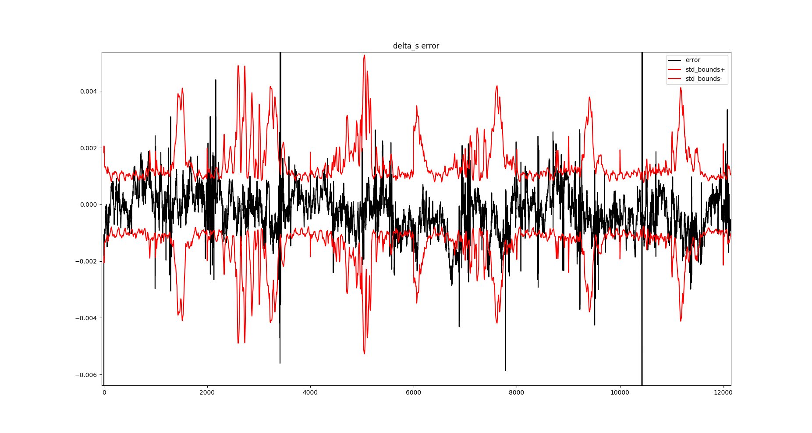

# Lab 8

This lab will be another lab that extends the one from last week. We will be working with the [Oxford Inertial Odometry Dataset](http://deepio.cs.ox.ac.uk/). However, this time we will make a more advanced ANN to process our data.

Because we are working from the lab from last week first just copy your submission for the last lab. If you struggled with the last lab and were not sure you did well please ask other students or the instructor for help.

## Multiple Inputs
First we will make separate input tensors for the IMU data and the magnetometer data. There is not a lot of real reason to do this except for an exercise in the lab. To do this you will need to use the Keras Functional API. There should be two different branches of input tensors that combine in some way before the end to have only one output tensor. You get to decide what the branches look like as long as there are two different input tensors to your model.

## Model Output
The more interesting part of this lab will be the output. While we will still have one output tensor, this time I want a confidence of how much the ANN trusts the output for distance travelled. For this we will configure our ANN to output the parameters of a normal (Gaussian) distribution. 

A [normal distribution](https://en.wikipedia.org/wiki/Normal_distribution) has two parameters, a mean and a standard deviation (or variance but we will use the standard deviation for our purposes). Thus, our model will output the mean of the change in distance and the standard deviation for that mean. From this we know that smaller standard deviations will equal more confidence in the answer. 

To get our network to output these model parameters, we need to make custom activation and custom loss functions. We will also make a custom metric to make it easier to evaluate performance. 

### Custom Activation
Our custom activation will force the standard deviation to be a positive number. Negative standard deviations make no sense (and potentially crash our code). Thus, we will prevent negative values from being possible. We also want to prevent the standard deviation from being exactly zero thus we need a function that goes to zero slowly or never actually gets to exactly zero. 

You might be thinking that if the function is for example $`f(x)=x^2`$ that it will only be zero if `x` is zero. While this is true in theory, in practice you need to remember about round off errors. In a computer if `x` is really close to zero it will underflow to exactly zero which would be bad for our model. In practice, we will use the `elu` function plus 1. The `elu` function is like `relu` but instead of being 0 when negative it slowly goes to -1. Thus, if we add one we will make our function go to zero slowly but also not explode when larger than 1. For example if we made our function $`f(x)=e^x`$, it would explode as `x` gets large. For more information on `elu` see this [site](https://ml-cheatsheet.readthedocs.io/en/latest/activation_functions.html#elu) 

For convenience, I have already given you the activation function required. Note you need to make this only apply to the standard deviation. If you use it as is you will apply the activation to the mean as well and that is not what we want.
```python
from tensorflow.keras.backend import elu
def activation_elu_plus_one(x):
    return elu(x) + 1
```

### Custom Loss
Our custom loss is a bit trickier. For example how do I come up with the standard deviation? I know that I could just do mean squared error between the prediction and the truth to get the mean distance travelled, but I don't have a label for standard deviation. Do not worry we have a solution to this problem. Since we want to parameterize a normal distribution we will ask the ANN to make our true targets as likely as possible. To do this you would try to pick the truth label with small standard deviation. However, if you are wrong you will lose a lot of probability due to the mismatch. Thus, you have to know when you will be wrong to increase the standard deviation and still maintain high probability. 

In practice, we will minimize the negative log likelihood of the normal distribution. The negative log probability has nice math properties and will make it easier to minimize for our optimizer. In order to calculate the negative log likelihood will use the `tensorflow-probability` package. 

Note, as of writing the tensorflow version is ==2.7.0 will work with tensorflow-probability ~=0.15.0. Using the wrong version could result in confusing errors to debug

We can calculate the normal distribution negative log likelihood with the following code to make TensorFlow functions:
```python
import tensorflow as tf
import tensorflow_probability as tfp
mean: tf.Tensor = tf.constant([0.0]) # this comes form ANN
standard_deviation: tf.Tensor = tf.constant([1.0]) # This comes from ANN
target: tf.Tensor = tf.constant([0.1]) # this is our truth label
normal_dist = tfp.distributions.Normal(loc=mean, scale=standard_deviation)
negative_log_likelihood = -normal_dist.log_prob(value=target)
```
Note that `mean`, `standard_deviation`, and `target` are `tf.Tensor` objects because that is what we expect from our ANN.

## Custom Metric
If we want to know how our training is going we will need some metric. Unfortunately basic mean absolute error expects our ANN output tensor and truth labels to have the same size but in our problem our ANN will output a mean and standard deviation and the label is just true distance. Thus, we need to make our own mean absolute error that only uses the predicted mean and true distance but not the standard deviation. Also remember that this value will be in the units of our scaled output. 

After making the mean absolute error for the scaled outputs (what the ANN is normally with), make a custom metric that uses the scaling parameters you used to scale you output. The custom metric will undo the scaling to show you the mean absolute error in the original output units.

## Summary
In summary, your model should have two inputs, one output tensor that has a mean and standard deviation. This output tensor will need a custom activation to ensure the standard deviation is always positive. Your custom loss needs to be the negative log likelihood of a Normal distribution with the output mean and standard deviation, evaluated at the target (truth or label) value. Finally there should be two metrics, one reporting the mean absolute error between the estimate mean and the target (scaled version), and another metric that unscales the outputs to give the mean absolute error in the original units. 

# Visualization
Include the two visualization plots form last time as well as one new one. 

The new plot will be the error between the mean prediction, and the truth distance. This plot will also have the standard deviation overlaid on the error to give an idea of the bounds our ANN was expecting. Remember to give the bounds as both positive and negative (they will mirror each other) as shown in the example plot below:


